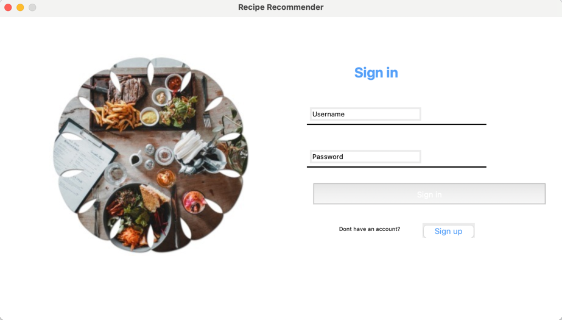

## Title: Recipe Recommender

### Team Members: Saumya Bansal & Mehmood Ali

Language Version: 

- Python 3.10

Special Instructions to Run the Code:

1. Ensure that you have an appropriate Python interpreter installed on your system.
2. Install files from requirements.txt
3. Run main.py to launch the Recipe Recommender application.

Note:

- The user needs to have an active internet connection to use the Recipe Recommender application.
- The Recipe Recommender application is designed to be run on a desktop computer/laptop and is not compatible with mobile devices or tablets.

Additional Information

The Recipe Recommender application is an interactive recipe recommendation system that provides users with personalized recipe suggestions based on their dietary preferences and previous search history.

Third-Party code vs. Original code Statement

We utilized a reference post by Jack Leitch on Medium (https://towardsdatascience.com/building-a-recipe-recommendation-api-using-scikit-learn-nltk-docker-flask-and-heroku-bfc6c4bdd2d4) for guidance on our model training approach in developing a recipe recommendation system. However, we made modifications to the code to account for updates since the post was published in 2020. Our initial step involved scraping data from the Jamie Oliver website, specifically the recipes section located at https://www.jamieoliver.com/recipes/category/course/mains/. We only used the code provided by Jack Leitch for the model training process, and we followed his guidelines but incorporated our own ideas and adaptations specific to our semester project.
For our desktop application, we built it entirely from scratch, implementing design patterns that we deemed suitable for our project. We did not seek any assistance or reference code for the application development aspect, ensuring that it was entirely our original work.